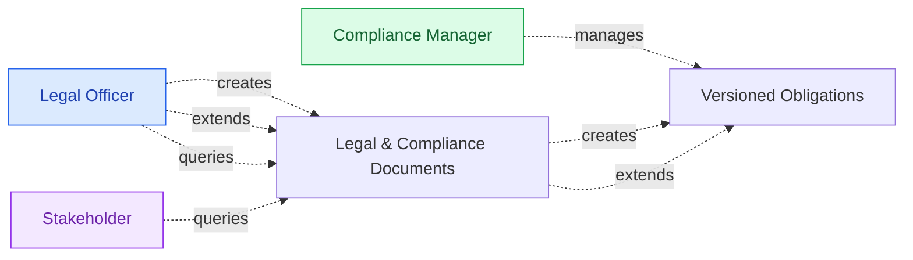
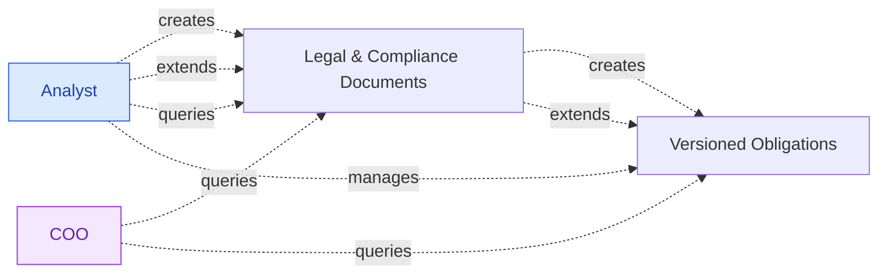
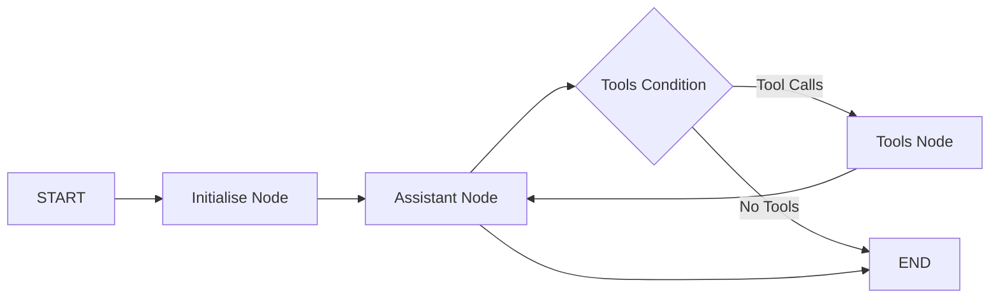

# Introduction 

A client asked the question: Can an Agent run my compliance for me?

The use case is helping a start up to automate and manage its compliance documentation and obligations to focus on product development.

A corporate may have teams that can manage compliance. 



However in a start up environment most people are wearing many hats.



## Problem Overview

- The business must comply with obligations across legislation, internal policies, procedures, contracts, standards, and ecosystem rules.
- The current compliance process is too manual for a small organisation with limited resources.
- The business needs a highly automated solution that identifies obligations and supports an operational process for managing them.
- The solution must provide a complete and transparent view of all obligations in one place.

## Non-Functional Requirements

- The solution must minimise manual effort because the organisation has limited compliance capacity.
- The solution must be highly automated to reduce dependency on repeated manual review.
- The solution must be clear and transparent so users can trust and review extracted obligations.
- The solution must produce output in Excel or Word because that is the required working format. The startup is a Microsoft shop.
- The solution should support repeatable scheduled execution as part of normal operations.
- The solution should handle multiple source types without requiring separate tracking processes.
- The solution must maintain a high degree of privacy and use only local storage for sensitive documents and outputs.

The key themes are **privacy**, **accuracy** and **trust** and **familiar formats**.

## Proof of Concepts

The first step was to prototype various tools and workflows before making recommendations of what is technically viable given the evolving nature of AI.

Starting small and initially querying an IT compliance document part of the use case.

### 1. Retrieval Augmented Generation (RAG) with Web App

The first [Rag Tutorial repo](https://github.com/kimnewzealand/rag-tutorial/blob/master/README.md) proof of concept was using a Retrieval Augmented Generation (RAG) to solve the problem of too much, relevant and sensitive data being loaded into an LLM.

In this repo, the RAG system reads a PDF document, retrieves the most relevant sections based on a user query using a vector ChromaDB in a web app.

The reason for using a web app is to build an end to end PoC assuming the user would prefer to interact with a chat interface. This assumption will be tested through all the PoCs.

See deployed app version here: [https://compliance-rag.streamlit.app/](https://compliance-rag.streamlit.app/)

```mermaid
flowchart LR
    A[Retrieval<br/>(Search DB)] --> B[Augmentation<br/>(Add Context)]
    B --> C[Generation<br/>(Answer w/LLM model)]
```

This system uses free LLM, free Hugging Face transformers library, free ChromaDB storage and runs locally.

However [simply retrieving text snippets using vector search isn’t enough.](https://towardsdatascience.com/beyond-rag/)

This led to the next PoC to attempt to provide better context in the system.

### 2. GraphRAG

GraphRAG is a variation of RAG where the underlying database used for retrieval is a knowledge graph or a graph database. 

This allows the model to reason over entities and relationships rather than flat text chunks.

See this paper for further reading : [A BENCHMARK TO UNDERSTAND THE ROLE OF KNOWLEDGE
GRAPHS ON LARGE LANGUAGE MODEL’S ACCURACY FOR
QUESTION ANSWERING ON ENTERPRISE SQL DATABASES](https://arxiv.org/pdf/2311.07509)

The [graphRAG tutorial repo](https://github.com/kimnewzealand/graphrag-tutorial) runs as a CLI interface rather than using a web app.
It uses a [Neo4j for Desktop](https://neo4j.com/download/) and a python script running locally to view the quality and timing of the responses.

```mermaid
flowchart LR
    A[Graph Retrieval<br/>(Neo4j Query)] --> B[Knowledge Augmentation<br/>(Graph Context)]
    B --> C[Generation<br/>(Answer w/Anthropic LLM)]
```

The GraphRAG does seem to give more semantic meaning than RAG. However both of these proof of concepts are simple abstractions.

There are libraries that provide high level abstractions to hide complexity while allowing customisation.

### 3. LlamaIndex

> LlamaIndex is a complete toolkit for creating LLM-powered agents over your data using indexes and workflows. For this course we’ll focus on three main parts that help build agents in LlamaIndex: Components, Agents and Tools and Workflows.

[LlamaIndex Tutorial repo](https://github.com/kimnewzealand/llama-index-tutorial)

Although this is a RAG Application with ChromaDB and Agent Workflow, it can support GraphRAG.

However I encountered too many  issues and errors during the PoC that I decided not to use LlamaIndex. eg
- Import & Dependency Issues 
- Session Management Issues
- Extensive configuration overhead

### 4. LangGraph

Moving on to another popular abstraction.

This [LangGraph tutorial repo](https://github.com/kimnewzealand/langgraph-tutorial) demonstrates a LangGraph-powered policy compliance assistant. The system showcases workflow patterns using offline, local LLMs for document processing and compliance analysis.

Agent with conversational UI using LangGraph Studio which also acts as an IDE.

The system implements a ReAct (Reasoning-Action) workflow pattern as a progression from RAG:
- **Reasoning**: The agent analyzes the current state and user request
- **Action**: Executes appropriate tools based on reasoning
- **Observation**: Processes tool outputs and updates state
- **Decision**: Determines next steps (continue with tools or provide final response)

This cycle ensures systematic problem-solving with clear decision points and state tracking.


### 5. A Readiness Tool

This idea was a left field one.

One of the barriers to making a leap to using a full agent was just getting started given the other priorities in the business.

The concept behind this tool is a daily tip and reward for thinking about data and AI.

https://chex-wheat.vercel.app

This is still a PoC and the name still resembles a breakfast cereal.

But it takes the requirements and groups these into categories:

- document
- metadata
- governance
- security
- integration
- ai-llm
- reporting
- pilot

This tool is still in trial.

## Lessons Learnt

Lessons so far categorised by the key themes from the requirements:

**Data privacy concerns:**
- It is possible to run LLM models locally and not in the cloud
- Realisation that data organisation is key for running the business manually or automating it with AI.

**Accuracy concerns:**
- The LLMs extraction of obligations are still viewed as not accurate compared to an analyst manually extracting the obligations to a spreadsheet

**Trust concerns:**
- The more abstracted a package/tool the more it becomes a black box 
- Web app chat UIs do not give transparency or visibility compared to direct reading of the underlying documents

**Familiar formats:**
- Excel is still preferred as a format for the output to manage the obligations
- The team does not have any in house engineers so any solution would need to be as low code or no code as possible

# Next steps

Microsoft options to try:

| Option | No-code? | Privacy? | Verdict |
|---|---|---|---|
| Copilot Studio | ✅ Drag-and-drop GUI | ❌ Cloud | Best fit if client accepts cloud |
| M365 Copilot + Graph connectors | ✅ Zero code | ❌ Cloud | Second-best, but pricier |
| Power Automate + AI Builder | ✅ Visual workflow | ❌ Cloud | Good for scheduled Excel output |
| Semantic Kernel | ❌ Needs Python code | ✅ Local | Best privacy, but requires engineer |
| Azure AI Studio | ⚠️ Moderate code | ❌ Cloud | Middle ground, still no privacy |