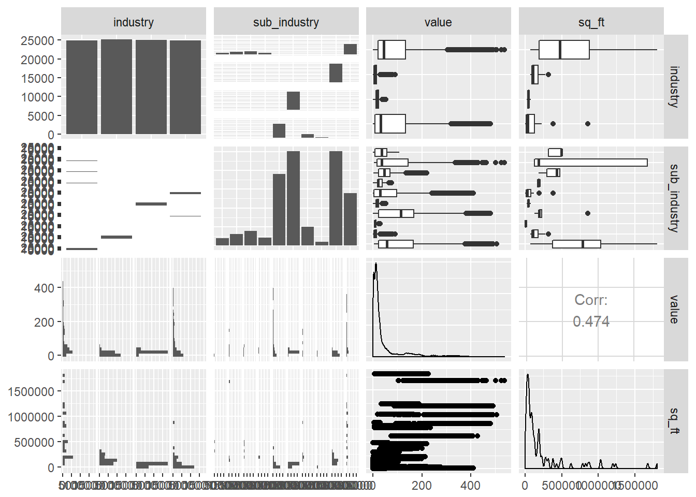

*30 January 2018*  

On 13th December 2017 I attended a day of the IASC-ARS/68th Annual NZSA Conference. I attended a talk by Rob Hyndman on [Probabilistic Outlier Detection And Visualization Of Smart Meter Data](https://jmcurran.github.io/NZSA-IASC-Prog/Wednesday.html#talk_188).

Inspired by Rob Hyndman's talk, I decided to perform an exploratory data analysis of smart meter data. There are a variety of open energy data [resources](hhttps://openei.org/wiki/Data). This analysis will use [ErNOC green button open data set](https://open-enernoc-data.s3.amazonaws.com/anon/index.html).

This [github](
https://petolau.github.io/Forecast-electricity-consumption-with-similar-day-approach-in-R/) was a useful starting point for analysis.


###


* * *

## Setup


**LOAD R PACKAGES**


```r
# Load tidyverse packages
library(tidyverse)
```

```
## Warning: package 'tidyverse' was built under R version 3.4.3
```

```
## Warning: package 'tibble' was built under R version 3.4.3
```

```
## Warning: package 'tidyr' was built under R version 3.4.3
```

```r
# Data import
library(stringr)
library(rvest)
```

```
## Warning: package 'xml2' was built under R version 3.4.3
```

```r
# Data visualisation
library(leaflet)
library(googleVis)
library(htmlwidgets)
```

```
## Warning: package 'htmlwidgets' was built under R version 3.4.3
```

```r
library(RColorBrewer)
library(treemap)
```

```
## Warning: package 'treemap' was built under R version 3.4.3
```

```r
# library(devtools)
# install_github("timelyportfolio/d3treeR")
library(d3treeR)
library(GGally)
```

```
## Warning: package 'GGally' was built under R version 3.4.3
```

```r
library(plotly)
# R Markdown layout
library(styler)
```

```
## Warning: package 'styler' was built under R version 3.4.3
```


###


* * *

## Data

**DATA SUMMARY**

We can find a summary of the EnerNOC Green Button data in the
[README](https://open-enernoc-data.s3.amazonaws.com/anon/README),

> This is anonymized 5-minute energy usage data for 100 commercial/ industrial sites for 2012. Actual reading values and identifying information such as geo coordinates and square footage have been anonymized, but the values have been skewed by a linear magnitude so that comparisons over time and between sites will remain consistent.

The data consists of metadata and csv files by building site.

This data is made available for non-commercial and research
purposes only under the Creative Commons Attribution-NonCommercial 3.0 license.

**LOAD DATA**

**1. Metadata**

First load the metadata from the website using read_csv function from the [readr](https://CRAN.R-project.org/package=readr) R package.


```r
# Read in the meta data using read_csv
meta <- read_csv("https://open-enernoc-data.s3.amazonaws.com/anon/meta/all_sites.csv")
# View the structure of meta
str(meta)
```

```
## Classes 'tbl_df', 'tbl' and 'data.frame':	100 obs. of  8 variables:
##  $ SITE_ID     : int  6 8 9 10 12 13 14 21 22 25 ...
##  $ INDUSTRY    : chr  "Commercial Property" "Commercial Property" "Commercial Property" "Commercial Property" ...
##  $ SUB_INDUSTRY: chr  "Shopping Center/Shopping Mall" "Shopping Center/Shopping Mall" "Corporate Office" "Shopping Center/Shopping Mall" ...
##  $ SQ_FT       : int  161532 823966 169420 1029798 179665 185847 1675720 783982 318130 1807149 ...
##  $ LAT         : num  34.8 40.3 40.9 39.7 39.7 ...
##  $ LNG         : num  -106.9 -76.4 -74.7 -75 -74.9 ...
##  $ TIME_ZONE   : chr  "America/Denver" "America/New_York" "America/New_York" "America/New_York" ...
##  $ TZ_OFFSET   : chr  "-06:00" "-04:00" "-04:00" "-04:00" ...
##  - attr(*, "spec")=List of 2
##   ..$ cols   :List of 8
##   .. ..$ SITE_ID     : list()
##   .. .. ..- attr(*, "class")= chr  "collector_integer" "collector"
##   .. ..$ INDUSTRY    : list()
##   .. .. ..- attr(*, "class")= chr  "collector_character" "collector"
##   .. ..$ SUB_INDUSTRY: list()
##   .. .. ..- attr(*, "class")= chr  "collector_character" "collector"
##   .. ..$ SQ_FT       : list()
##   .. .. ..- attr(*, "class")= chr  "collector_integer" "collector"
##   .. ..$ LAT         : list()
##   .. .. ..- attr(*, "class")= chr  "collector_double" "collector"
##   .. ..$ LNG         : list()
##   .. .. ..- attr(*, "class")= chr  "collector_double" "collector"
##   .. ..$ TIME_ZONE   : list()
##   .. .. ..- attr(*, "class")= chr  "collector_character" "collector"
##   .. ..$ TZ_OFFSET   : list()
##   .. .. ..- attr(*, "class")= chr  "collector_character" "collector"
##   ..$ default: list()
##   .. ..- attr(*, "class")= chr  "collector_guess" "collector"
##   ..- attr(*, "class")= chr "col_spec"
```

```r
# Convert the headings from upper case to lower case
meta <- meta %>%
  rename_all(tolower)
```

**2. EnerNOC GreenButton Data**

To import the green button data csv files, we will use a vectorisation approach and import each csv direct from the data source using tidyverse packages.   This also  seemed to be a good chance to practice web scraping. An alternative approach would be to load the all-data.tar.gz and then untar and rbind the individuals csv files but this would not be a flexible and scalable process if files were continuously saved to source as in a live system.

First we will use the [rvest]( https://CRAN.R-project.org/package=rvest) R package which is used for web scraping.

We need to check if the source with the csv files can be scraped and then identify the CSS selectors. Then we create a vector of the urls.


```r
# Set the source html link for the csv files in the ernoc website
ernocindex <- "https://open-enernoc-data.s3.amazonaws.com/anon/csv/index.html"
# Parse the html page using read_html
ernochtml <- read_html(ernocindex)
# From inspecting the page for the CSS slectors, we see the csv files are in element table with classname table, element td and element a.
# Load the file names as a text vector using html_nodes and html_text functions
filenames <- ernochtml %>%
  html_nodes("table.table td a") %>%
  html_text()
# Check there are a 100 filenames for each of the 100 sites as per the README
length(filenames)
```

```
## [1] 100
```

```r
# Create a vector of the urls for the csvs. An examaple url is "https://open-enernoc-data.s3.amazonaws.com/anon/csv/10.csv". First set the base url
ernocbase <- "https://open-enernoc-data.s3.amazonaws.com/anon/csv/"
# Combine the base url with the filenames using paste
urls <- paste(ernocbase, filenames, sep = "")
# Check the first 5 urls to ensure the correct format
head(urls)
```

```
## [1] "https://open-enernoc-data.s3.amazonaws.com/anon/csv/10.csv" 
## [2] "https://open-enernoc-data.s3.amazonaws.com/anon/csv/100.csv"
## [3] "https://open-enernoc-data.s3.amazonaws.com/anon/csv/101.csv"
## [4] "https://open-enernoc-data.s3.amazonaws.com/anon/csv/103.csv"
## [5] "https://open-enernoc-data.s3.amazonaws.com/anon/csv/109.csv"
## [6] "https://open-enernoc-data.s3.amazonaws.com/anon/csv/111.csv"
```

```r
# Check the class of urls
str(urls)
```

```
##  chr [1:100] "https://open-enernoc-data.s3.amazonaws.com/anon/csv/10.csv" ...
```

The urls vector is of class character.

The function map_dfr from the [purrr](https://cran.r-project.org/web/packages/purrr/index.html) R package applies a function to every element of an input (in this case the vector urls) and binds together the result by row. Each of these results was another dataframe created by column joining two other dataframes.

The function cbind was used to join the dataframes of each site id's greenbutton data with the site id variable. The read function used is again read_csv.

To create the new site id variable, we also need to extract and add the site id as a new column to the resulting dataframe to identify each location's data using [stringr](ttps://CRAN.R-project.org/package=stringr) R package.


I initially tried the dplyr function bind_cols to have tidyverse consistency but this created errors as the dataframes needed to have the same number of rows. So I used the potentially slower cbind base function. Then realised that cbind is a wrapper for data.frame and defaults stringsAsFactors=TRUE. Therefore tried to use the data.frame with stringsAsFactors =FALSE with the added benefit that it also recycles the single character  vector as needed here, and it may be faster. Reverted back to cbind, although not in the tidyverse and potentially slower it recycles the single character as required.


```r
# Since there are many files to read, suppress the messages for read_csv
suppressMessages(read_csv)
```

```
## function (file, col_names = TRUE, col_types = NULL, locale = default_locale(), 
##     na = c("", "NA"), quoted_na = TRUE, quote = "\"", comment = "", 
##     trim_ws = TRUE, skip = 0, n_max = Inf, guess_max = min(1000, 
##         n_max), progress = show_progress()) 
## {
##     tokenizer <- tokenizer_csv(na = na, quoted_na = TRUE, quote = quote, 
##         comment = comment, trim_ws = trim_ws)
##     read_delimited(file, tokenizer, col_names = col_names, col_types = col_types, 
##         locale = locale, skip = skip, comment = comment, n_max = n_max, 
##         guess_max = guess_max, progress = progress)
## }
## <environment: namespace:readr>
```

```r
options(readr.num_columns = 0)
# Set stringsAsFactors to FALSE for cbind which is wrapper for data.frame
options(stringsAsFactors = F)
# Create a function to extract the site ID from the urls using stringr
siteid <- function(x) {
  str_replace_all(x, c("https://open-enernoc-data.s3.amazonaws.com/anon/csv/" = "", ".csv" = ""))
}
# Load all the csv file data into a single dataframe with the site ids as a new column, renamed to be the same as the site_id column in the meta dataframe.
greenbutton <- map_dfr(urls, function(x) cbind(read_csv(x), siteid(x))) %>%
  rename(site_id = "siteid(x)")
# Take a look at the structure of the greenbutton dataframe
str(greenbutton)
```

```
## 'data.frame':	10531288 obs. of  6 variables:
##  $ timestamp: int  1325376600 1325376900 1325377200 1325377500 1325377800 1325378100 1325378400 1325378700 1325379000 1325379300 ...
##  $ dttm_utc : POSIXct, format: "2012-01-01 00:10:00" "2012-01-01 00:15:00" ...
##  $ value    : num  106 105 102 103 102 ...
##  $ estimated: int  0 0 0 0 0 0 0 0 0 0 ...
##  $ anomaly  : chr  NA NA NA NA ...
##  $ site_id  : chr  "10" "10" "10" "10" ...
```

The green button data information from the README is as follows:

> Each row of the file contains the following values:

>   epoch timestamp, Date/ time, reading value, estimated indicator, anomaly indicator

> The `estimated indicator` is a boolean indicating if the reading was estimated.  The
`anomaly indicator` is non-blank if the reading was erroneous.  Note also that the
unit of measure for energy data is kWh in the CSV files.

###


* * *

## Exploratory Data Analysis

**SITE LOCATIONS**

The meta data includes spatial coordinates. We can plot these point vector data on a map. We will consider two approaches, first using gVisMap then leaflet.

**1. googleViz**

We can map the site IDs of the 100 commercial locations first using [googleViz](https://CRAN.R-project.org/package=googleVis ) R package and the function gvisMap.


```r
# Create a new column combining the latitude and longitude coordinates as a parametr for the googleViz map
meta$latlng <- paste(meta$lat, meta$lng, sep = ":")
# Create a map object IDmap of the site IDs
IDmap <- gvisMap(
  meta, "latlng", "site_id",
  options = list(
    showTip = TRUE, showLine = F, enableScrollWheel = TRUE,
    mapType = "hybrid", useMapTypeControl = TRUE, width = 800, height = 400
  )
)
# Plot the map object IDmap
plot(IDmap)
```

**2. Leaflet**

Next plot the site IDs using using the Hydda.Full provider from the leaflet [providers link](http://leaflet-extras.github.io/leaflet-providers/preview/index.html). The Hydda.Full provider has detailed cities and towns to get an idea of the proximity of these locations using the zoom.


```r
# Create leaflet map of the metadata
IDmap2 <- leaflet() %>%
  addTiles() %>%
  addProviderTiles(providers$Hydda.Full) %>%
  addMarkers(lng = meta$lng, lat = meta$lat, label = meta$site_id)
# Plot leaflet map
IDmap2
```

preserve8a46d0cb7f4f3a76

```r
# Save leaflethtml to file using the htmlwidgets package saveWidget function
# saveWidget(IDmap2, "siteIDsleaflet.html") # do not save to Hugo content folder
```

The leaflet map automatically sizes the map of the US to fit these location markers and plots from the latitude and longitude variables. Unlike gvisMap, leaflet does not require pasting the coordinates together or a separate plot function.

**MERGED METADATA AND GREEN BUTTON DATA**

Next we will look at a sample of the merged green button and metadata as the dataset is very large to get an overview of the variables. We will use ggpairs from the [GGally](https://CRAN.R-project.org/package=GGally) R package to see the relationships between the variables.


```r
# set seed for reproduceability
set.seed(123)
# Take a sample of the greenbutton dataset as it is very large
gbsample <- sample_n(greenbutton, 100000)
# Merge the metadata and the greenbutton datasets into gball using the merge function
gbmerge <- merge(gbsample, meta, by = "site_id")
# ggpairs plot of the industry, sub-industry, value and sq_ft variables
ggpairs(
  gbmerge,
  columns = c("industry", "sub_industry", "value", "sq_ft")
)
```



From the ggpairs plot we can see a correlation between the continuous variables sq_ft and the value of 0.474. The distribution of the sq_ft and values are both positively or right skewed. The box plots also suggest potential outliers.

**BUILDING SIZE**

Next let's take a look at a treemap of the industry and sub-industries by building size in square foot.


```r
# Basic treemap with customised colours annd labels to
T1 <- treemap(
  meta,
  index = c("industry", "sub_industry"),
  vSize = "sq_ft",
  type = "index",
  align.labels = list(
    c("center", "center"),
    c("right", "bottom")
  ),
  fontcolor.labels = c("white", "yellow"),
  palette = "Set2",
  title = "Industry and sub-industries by building size(sq ft)",
  fontsize.title = 12
)
```


```r
# Make the treemap interactive ("rootname" becomes the title of the plot):
interT1 <- d3tree2(T1, rootname = "Industry and sub-industries by building size(sq ft)")
interT1
```

preserve4af55860ebcc11a1

```r
# saveWidget(interT1, "interT1.html") # do not save to Hugo content folder
```

Take a look at the industry and sub-industry by the size of the location using density plots. The sub-industry has 10 data classes so I used the brewer palette Paired from http://colorbrewer2.org/ and to view the overlaying density plots, and set alpha to 0.75 change the transparency.


```r
# Density plot of the metadata sq_ft floor size by industry
ggplot(meta, aes(sq_ft, colour = industry, fill = industry)) +
  geom_density(alpha = 0.75) +
  scale_fill_brewer(type = "qual", palette = "Dark2", direction = 1) +
  scale_color_brewer(type = "qual", palette = "Dark2", direction = 1) +
  scale_y_continuous(labels = scales::comma) +
  xlab("Floor size (sq ft)") +
  ylab("Density") +
  ggtitle("Density Plot of the Industries by Floor Size")
```


```r
# Density plot of the metadata sq_ft floor size by sub-industry
ggplot(meta, aes(sq_ft, colour = sub_industry, fill = sub_industry)) +
  geom_density(alpha = 0.75) +
  scale_fill_brewer(type = "qual", palette = "Paired", direction = 1) +
  scale_colour_brewer(type = "qual", palette = "Paired", direction = 1) +
  scale_y_continuous(labels = scales::comma) +
  xlab("Floor size (sq ft)") +
  ylab("Density") +
  ggtitle("Density Plot of the Sub-Industries by Floor Size")
```

```
## Warning: Groups with fewer than two data points have been dropped.
```


From these density plots we can see the distributions of the industries and sub-industries by floor size.

The light industrial and education industries have  positive skew and high peaks, or high kurtosis. The Food sales industry has high kurtosis and centred around a smaller mean floor size than the other industries

When looking at the sub-industries, these break out the industries further. The Shopping centers which is the large proportion of the commercial property industry is flat topped, or very low kurtosis  across the floor size  range. The other commercial sub-industries such as corporate office and banks are multimodal. The Grocer/Market explains the small Food Sales industry size.

**READING VALUES**

We will finally look at time series plots using ggplot of the reading value in kWh by sub-industry.


```r
# Plot time series of the values facetted by industry
industryts <- ggplot(gbmerge, aes(dttm_utc, value, colour = industry)) +
  geom_line() +
  facet_grid(industry ~ ., scales = "free_y") +
  ggtitle("Reading Value(kWh) by Industry for 2012") +
  xlab("Date/ time") +
  ylab("Reading value (kWh)")
# Plot the industryts plot
industryts
```


```r
# Plot an interactive version using ggplotly
ggplotly(industryts)
```

preserved93eacfb5b36d7dd

```r
# Plot time series of the values facetted by sub-industry
ggplot(gbmerge, aes(dttm_utc, value, colour = sub_industry)) +
  geom_line() +
  facet_grid(sub_industry ~ ., scales = "free_y") +
  ggtitle("Reading Value(kWh) by Sub-Industry for 2012") +
  theme(strip.text.y = element_blank()) +
  xlab("Date/ time") +
  ylab("Reading value (kWh)")
```


Finally using the styler R package, style this file in tidyverse_style.


```r
style_file("Smart meter EDA.Rmd", style = tidyverse_style)
```

```
## Styling  1  files:
##  Smart meter EDA.Rmd
```

```
## Warning in readLines(con, warn = FALSE, n = n, ok = ok, skipNul =
## skipNul, : cannot open file 'Smart meter EDA.Rmd': No such file or
## directory
```

```
## Warning in value[[3L]](cond): Cannot read Smart meter EDA.Rmd: cannot open
## the connection
```

```
## Warning in file(path, "rb"): cannot open file 'Smart meter EDA.Rmd': No
## such file or directory
```

```
## v 
## ----------------------------------------
## Status	Count	Legend 
## v 	1	File unchanged.
## i 	0	File changed.
## x 	0	Styling threw an eror.
## ----------------------------------------
```
